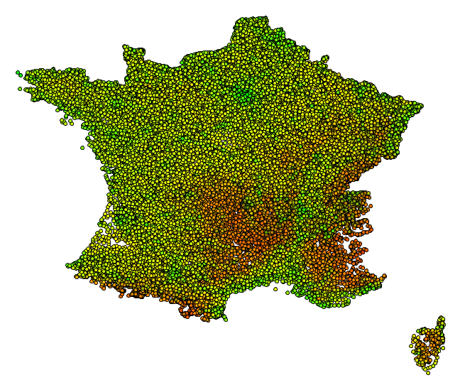
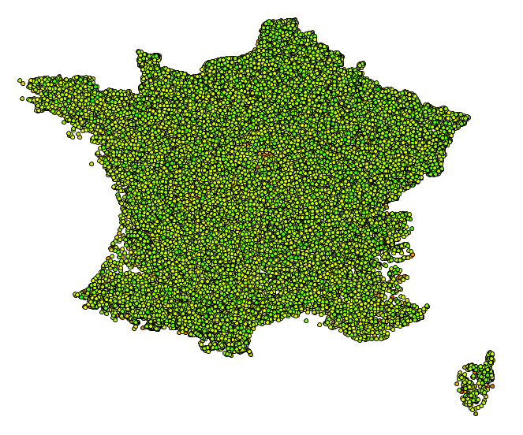
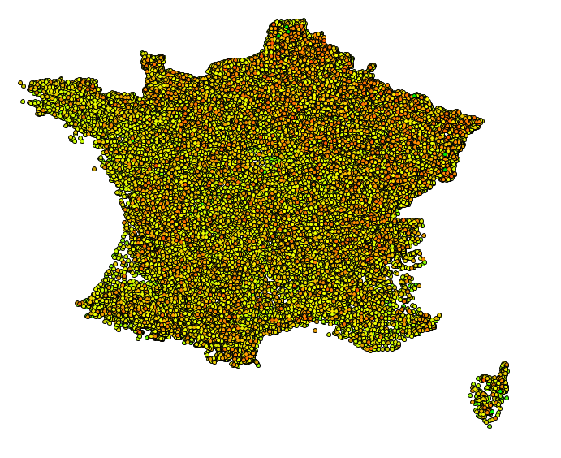
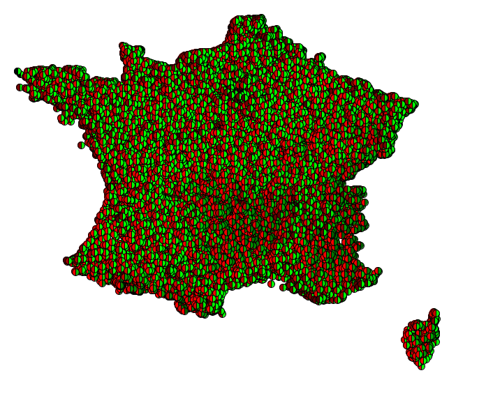
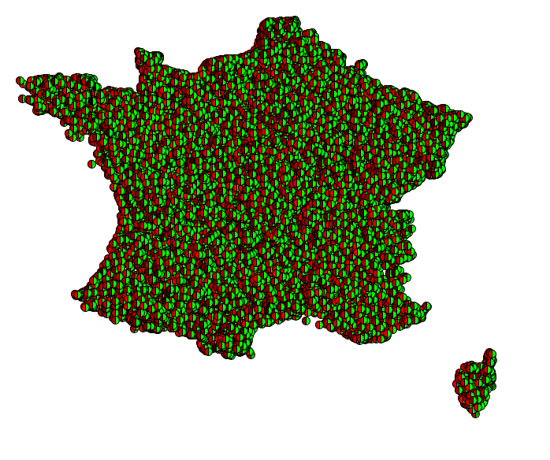
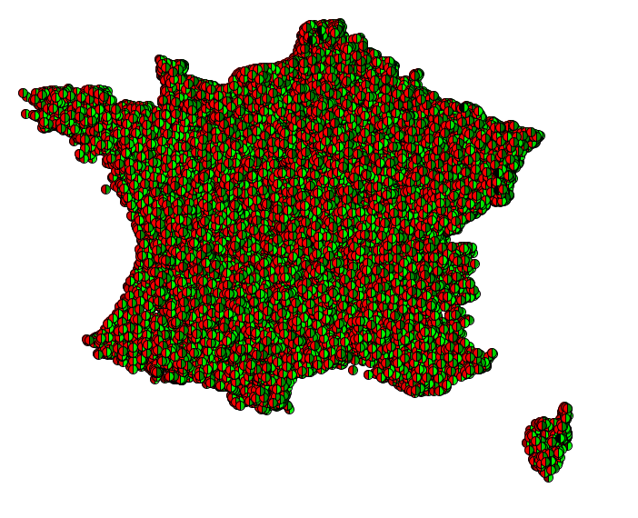
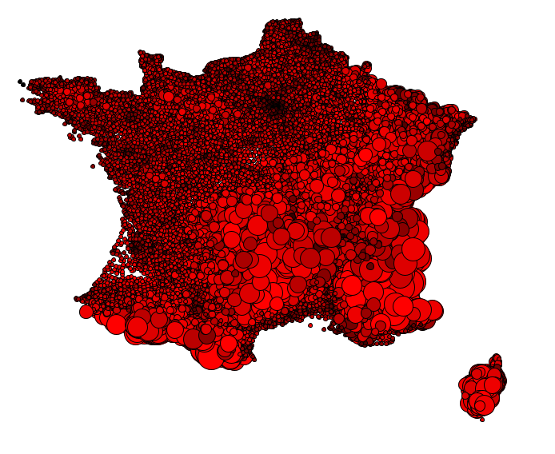
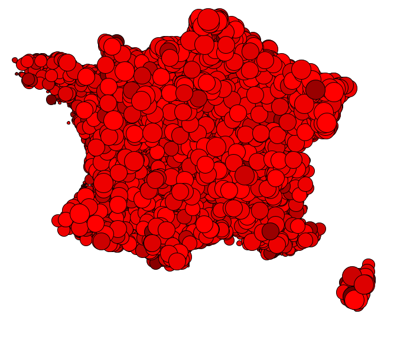
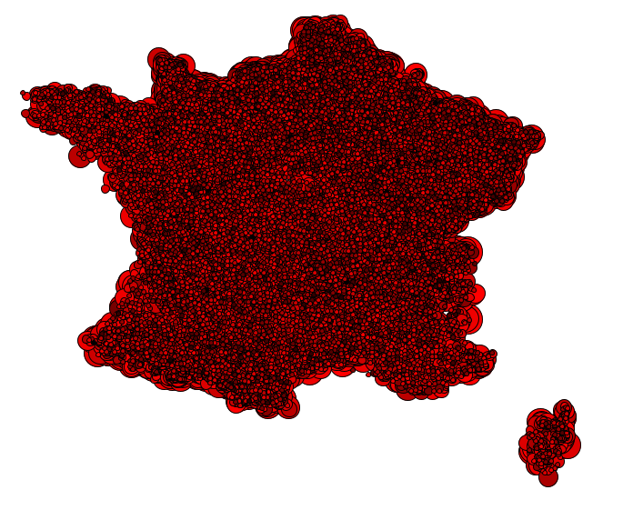
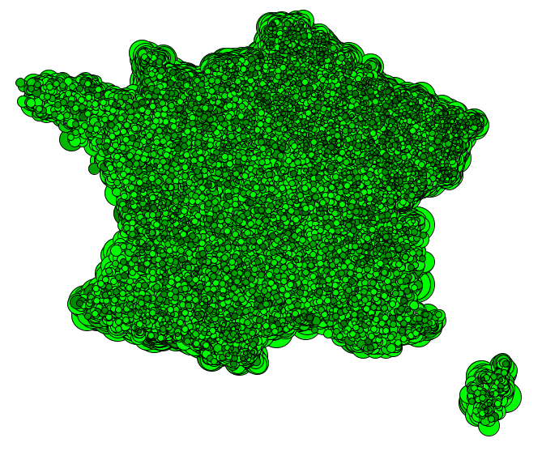

# IHMA - Visualisation d'Information

## Questions

### **Étape 5 : Dessiner un point par ville**

Lancez l'application... Toujours pas de points à l'écran ? C'est normal ! Pourquoi ?

    Les coordonnées des points dans le fichier .tsv sont comprises à peu près entre -1 et 1 (à peu près, d'où l'intérêt de récupérer les valeurs min et max des coordonnées x et y). Sauf que pour dessiner les points noirs, les opérations se font pixel par pixel et les pixels ont des indices discrets allant de (0,0) à (800,800). Ainsi, lors du code, lorsqu'on prend la partie entière des coordonnées des villes dans le .tsv, on se retrouve avec des 0.

### **Étape 6 : Convertir les coordonnées réelles en coordonnées écran**

Observez les valeurs correspondant aux coordonnées x et y de vos villes. Que pouvez-vous en déduire ?

    Qu'il faudra effectuer un changement d'échelle des coordonnées de nos villes pour correspondre aux coordonnées pixel.

### **Définir les marques**

Chaque ville doit être représentée par une marque encodant au moins deux attributs (e.g., densité, population, altitude).

        Choisissez au moins deux attributs à encoder visuellement, et déterminez la variable rétinienne à associer à chacun des attributs choisis.

On choisira de représenter la densité de population en fonction de l'altitude de la ville.

Peu importe la valeur rétinienne choisie pour ces deux attributs, il semble important de déterminer des seuils de valeurs afin d'appuyer, de rendre plus visuellement marquant, les représentations des attributs.

On s'appuiera donc sur [cette source](http://www.cartesfrance.fr/geographie/cartes-population/carte-densite-population-2009.html) pour déterminer les seuils des densités de populations et sur [cette source](http://www.carte-du-monde.net/pays-218-carte-altitude-france.html) pour déterminer les seuils d'altitudes.

Ensuite se pose la question des valeurs rétiniennes à choisir pour chacun de nos attributs.

On pourra essayer d'utiliser la couleur pour représenter les deux attributs, donc dans l'exemple suivant, chaque ville passe du rouge au noir (variable R du RGB de 255 à 0) selon si la densité est importante et passe du vert au noir (variable G de 255 à 0) selon si l'altitude est importante. Ainsi, une ville en jaune indiquera une faible population dans une basse ville et une ville noire indiquera une ville fortement peuplée avec une haute altitude.

Nous serions en droit de nous poser la question de l'influence de l'ordre d'affichage des villes sur la représentation. Des villes affichées peuvent en cachés les précédentes. Ainsi nous utiliserons le [tri rapide](http://www.dailly.info/ressources/tri/java/rapide.html) pour trier nos villes. Voici donc la même carte que précédemment avec d'abord à gauche un trie selon les altitudes et ensuite à droite un trie selon les densités de population.

La pertinence est discutable mais nous pouvons essayer une autre disposition des couleurs pour représenter nos attributs. Nous pourrions penser des disques coupés en deux, dont l'une moitié gauche représenterait la densité de population (avec le même code couleur que précédemment, du rouge au noir selon la grandeur de la densité) et l'autre moitié droite représenterait l'altitude (comme précédemment, du vert au noir). Ainsi vous pouvez voir de gauche à droite : la représentation avec les demi-disques, la représentation triée selon les altitude et la représentation triée selon les densités :

Le problème ici est la disposition des couleurs, lorsqu'une couleur est plus visible que l'autre, elle vient "effacer" la nuance visible de l'autre couleur. Ce qui est non satisfaisant lorsque nous cherchons à afficher les deux attributs sans donner de priorité de visibilité à chacune.

Nous essaierons donc d'utiliser la couleur et l'échelle de grandeur pour représenter nos villes.
Ainsi, nous essaierons d'affecter la grandeur de la ville à son altitude et sa couleur à sa densité. Plus la ville est grande plus son altitude est grande et plus sa couleur est noire (du rouge au noir) plus elle est peuplée.

On voit ici un problème, les villes trop hautes vont cacher les plus basses. Il sera donc ici primordial de trier les villes selon leur altitude. Mais attention à l'ordre de trie, car si nous les trions des plus basses aux plus hautes, nous obtenons cette carte : 

En effet, il faut d'abord afficher les plus grosses villes puis ensuite afficher les plus basses, pour qu'elles ne soient pas cachées. Ainsi, en triant les villes des plus hautes au plus basses, nous obtenons cette carte :

On pourrait décider d'inverser nos choix, d'affecter la grandeur à la densité et la couleur à l'altitude (du vert au noir). En vous épargnant les étapes de trie, nous obtenons cette carte :

En définitif, on remarque qu'il est compliqué de lire des informations des cartes en mêlant grandeur et couleur. Si nous reprenons notre première carte qui est la suivante : 

Nous pouvons tirer les informations suivantes de celle-ci:

* Les zones principalement vertes sont des zones très habitées (absence de rouge)
* Les zones à haute altitude sont les zones rouges (absence de vert)
* Les zones les plus sombres sont des zones hautes et denses
* Les zones jaunes sont équilibrés entre altitude et densité
* Les zones peu peuplées comme les chaînes montagneuses ou la diagonale sont visibles et les zones fortement peuplées sont également visible (comme par exemple Paris qui est très vert)

Cependant il y a des limites à cette représentation, en effet comme le montre le trie d'affichage des villes, on remarque que des villes sont cachées... Faudrait-il des techniques d'interactions pour rendre l'information davantage visible..?

## Techniques d'interactions

On met en place un filtre sur l'affichage des villes avec un seuil de population avec lequel seuls les villes avec plus de population que le seuil seront affichées.

Plusieurs techniques d'interactions ont donc été mises en place :

* avec les flèches gauches et droites vous pouvez faire baisser et augmenter de 100 le seuil de population
* avec les flèches bas et haut vous pouvez baisser et augmenter de 1000 le seuil de population
* avec le slider vous pouvez faire fluctuer le seuil de 0 jusqu'à un nombre indéterminé car en effet lorsque vous tirez le slider au delà de sa limite supérieur, il devient rouge foncé et il est possible d'aller aussi loin que la fenêtre graphique le permet (ce slider a été fortement inspiré de [ce slider](https://openprocessing.org/sketch/103317/))
* avec les touches backspace et enter, vous réinitialisez le seuil à 10000
* le bubble cursor est mis en place pour rendre plus visible la selection de ville ( souvenir de IHM de l'année dernière ;) )
* lorsqu'une ville est survolée, on voit son nom affiché
* lorsqu'une ville est selectionnée, elle devient rouge et le seuil est changé pour être égal au nombre de population de la ville selectionnée - 1 
